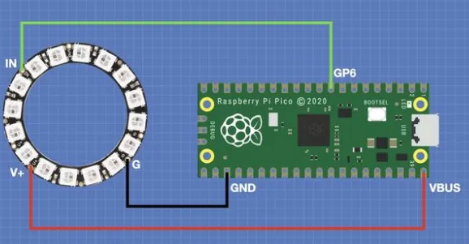
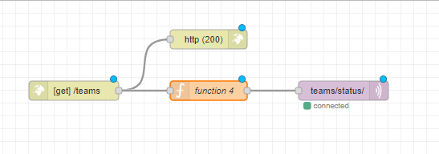
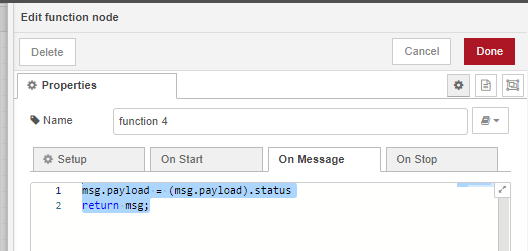
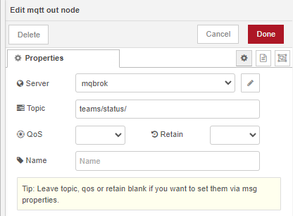
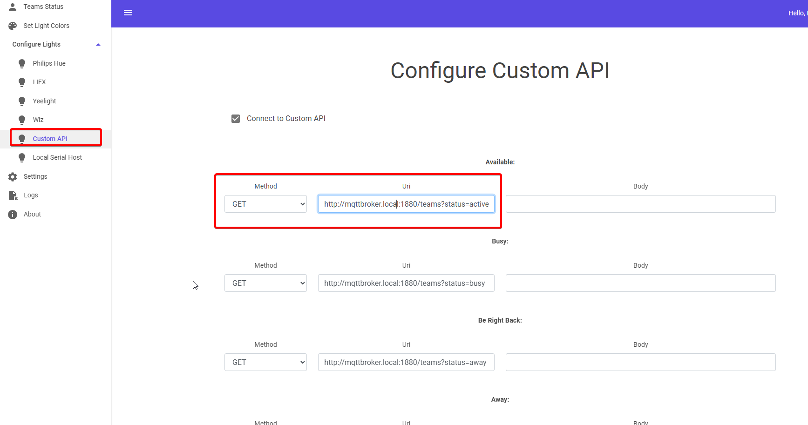

# Teams Status Color Indicator

This project changes the color of a NeoPixel Ring based on your Microsoft Teams status. It uses a Raspberry Pi Pico W, NeoPixel Ring, Node-RED, and MQTT for communication. The status information is fetched from the PresenceLight using API.

## Components

- [Raspberry Pi Pico W](https://www.raspberrypi.org/products/raspberry-pi-pico/)
- [NeoPixel Ring](https://www.adafruit.com/category/168)
- [Node-RED](https://nodered.org/)
- [MQTT Broker](https://mqtt.org/)
- [PresenceLight](https://github.com/isaacrlevin/PresenceLight)

## Files and Images

- `main.py`: The main Python code to run on the Raspberry Pi Pico W.
- `neo.png`: Picture of the Raspberry Pi Pico W connected to the NeoPixel Ring.
- `node1.png`: Screenshot of the Node-RED flow.
- `node2.png`: Screenshot of the Node-RED function block to get the status.

## Prerequisites

- Python 3.x installed on your computer.
- Node-RED installed and running.
- MQTT Broker set up and running.
- Raspberry Pi Pico W configured with MicroPython.
- NeoPixel library for MicroPython installed on the Pico W.

## Setup

# Raspberry Pi Pico W, Node-Red, MQTT, PresenceLight

1. Install MicroPython on your Raspberry Pi Pico W.
2. Copy the `main.py` file to your Pico W. Install NeoPixel library.
3. Install PresenceLight from Windows store, authenticate
4. Node-Red, create HTTP In, setting /teams: should be able to GET http://localhost:1880(YOUR NODE_RED IP:PORT)/teams?status=active

5. Node-Red, create function block to get status

6. Connect to MQTT out (setting to your MQTT broker)
   

  
7. PresenceLight, use API to point to the Node-Red HTTP in

8. Node-Red, MQTT to send status to internal Broker

9. 3D print case for Pico and Neopixel

